# Visualization of tests in GeoGebra

## Triangles in one plane

  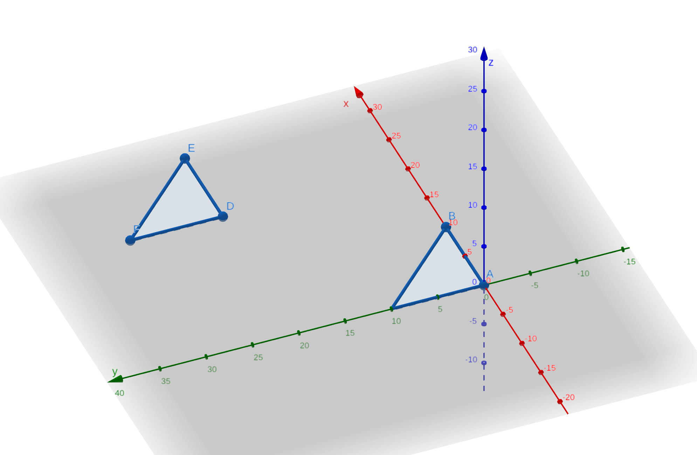
   
  <em>Test 2: TrianglesTest_one_plane.2</em>

  <em>Expected: nothing (no cross)</em>

   

  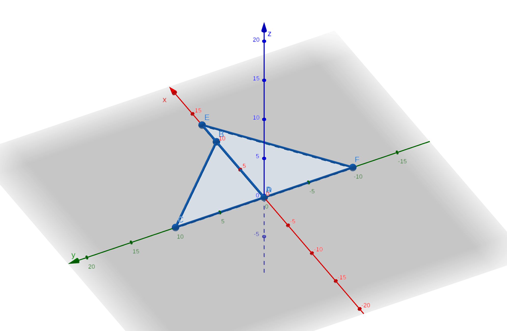
   
  <em>Test 3: TrianglesTest_one_plane.3</em>

  <em>Expected: overlap</em>

   

  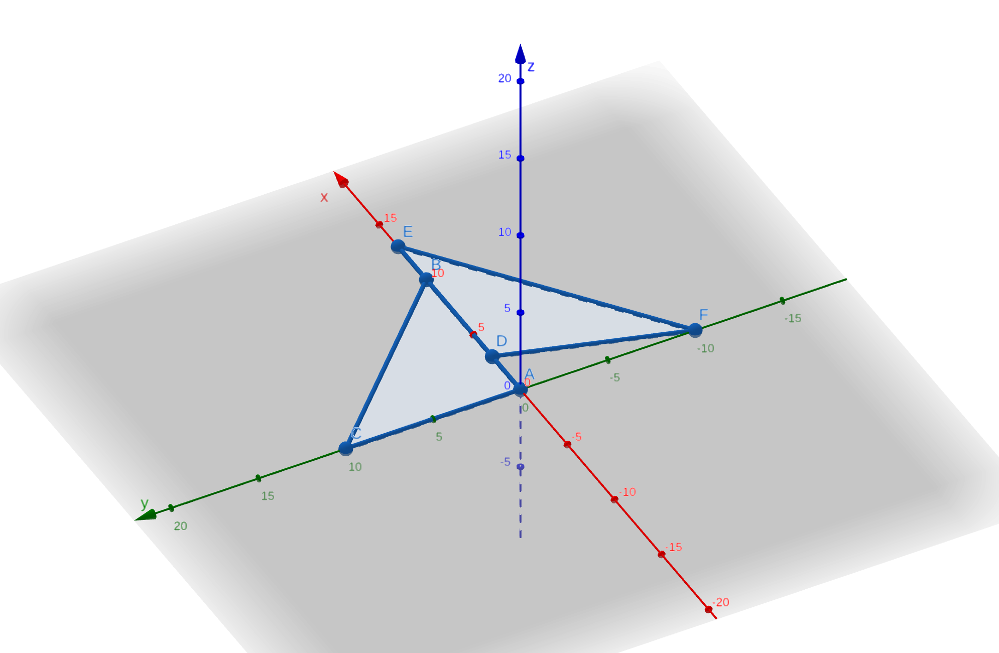
   
  <em>Test 4: TrianglesTest_one_plane.4</em>

  <em>Expected: overlap</em>

   

  
   
  <em>Test 5: TrianglesTest_one_plane.5</em>

  <em>Expected: overlap</em>

   

  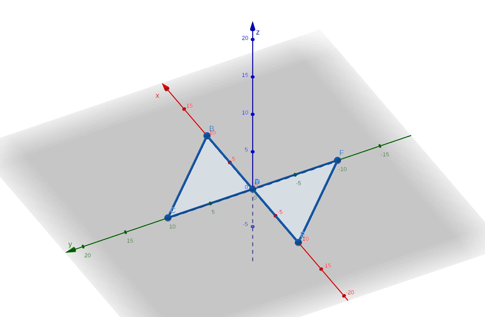
   
  <em>Test 6: TrianglesTest_one_plane.6</em>

  <em>Expected: overlap</em>

   

  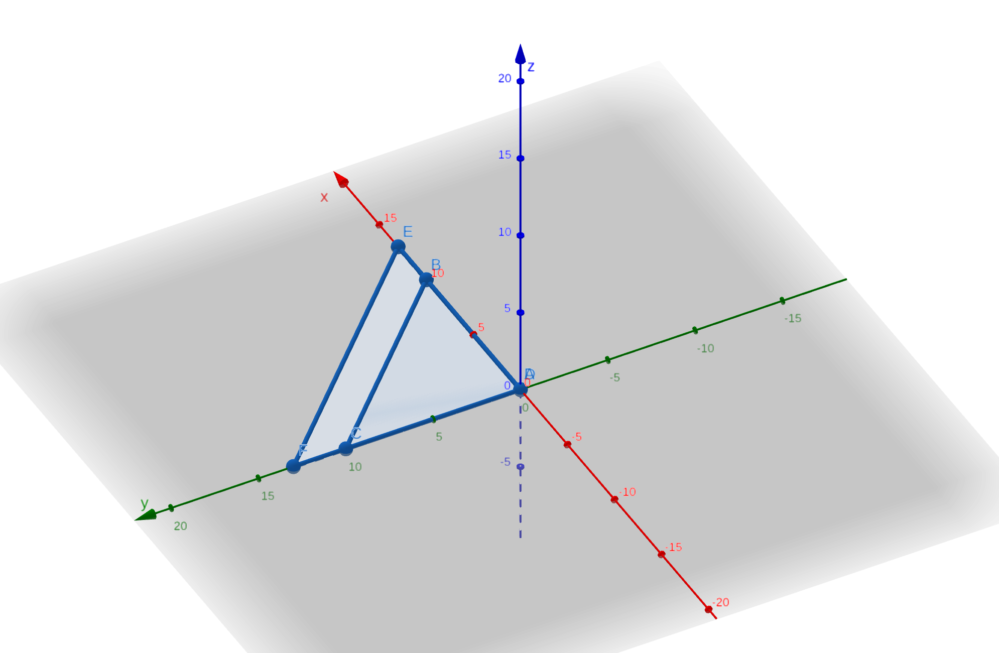
   
  <em>Test 7: TrianglesTest_one_plane.7</em>

  <em>Expected: overlap</em>

   

  
   
  <em>Test 8: TrianglesTest_one_plane.8</em>

  <em>Expected: overlap</em>

   

  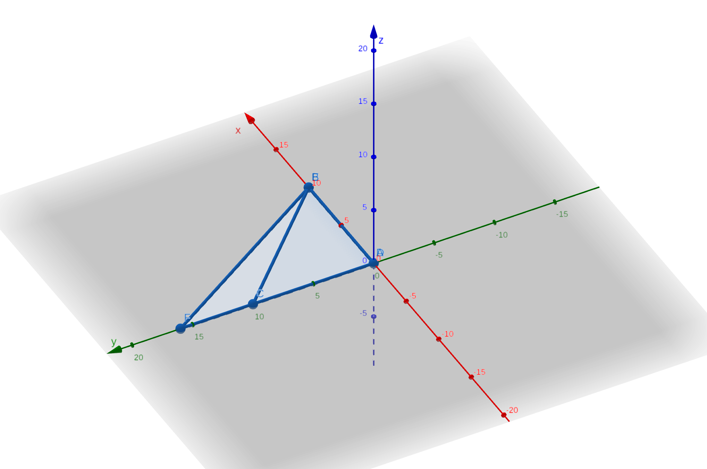
   
  <em>Test 9: TrianglesTest_one_plane.9</em>

  <em>Expected: overlap</em>

   

  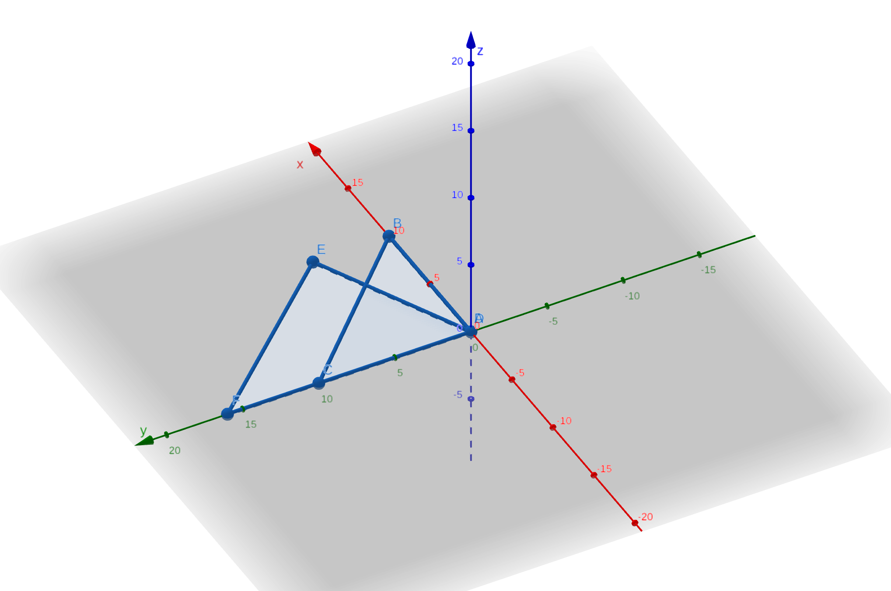
   
  <em>Test 10: TrianglesTest_one_plane.10</em>

  <em>Expected: overlap</em>

   

  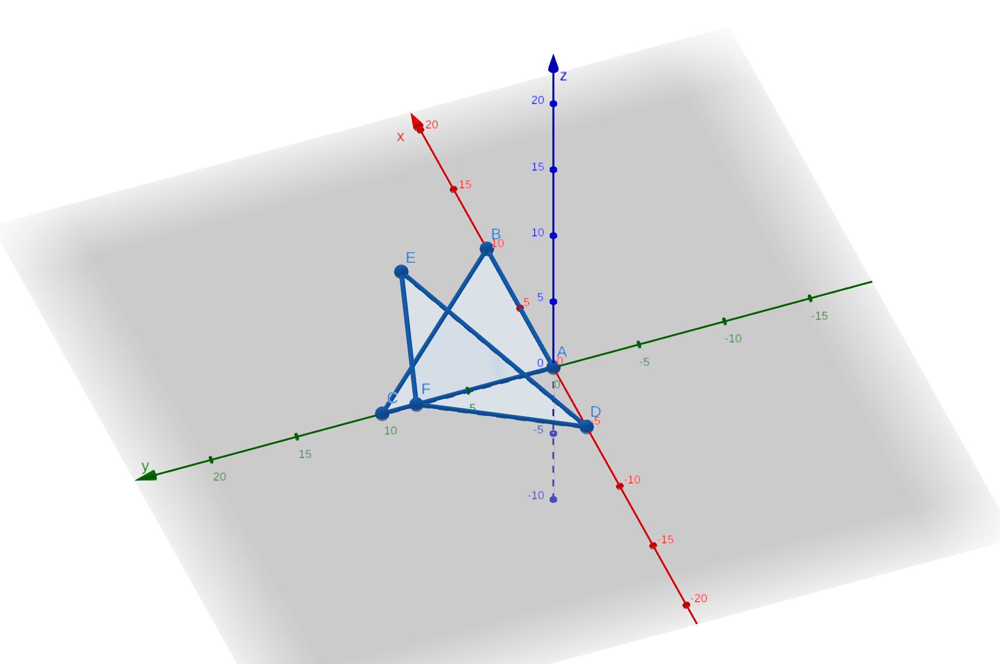
   
  <em>Test 12: TrianglesTest_one_plane.12</em>

  <em>Expected: overlap</em>

   

  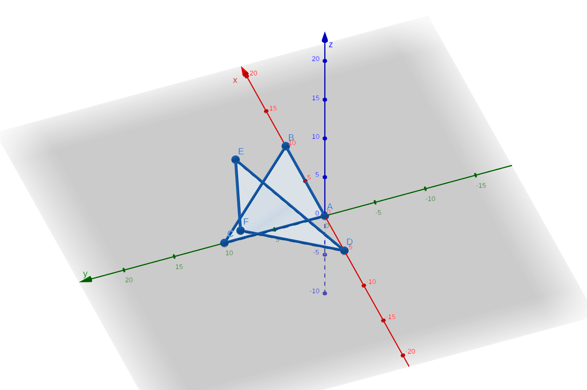
   
  <em>Test 13: TrianglesTest_one_plane.13</em>

  <em>Expected: overlap</em>

   

  
   
  <em>Test 14: TrianglesTest_one_plane.14</em>

  <em>Expected: overlap</em>

## Triangles in parallel planes

  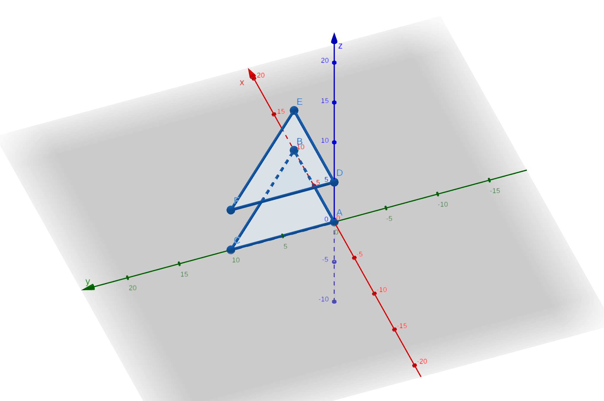
   
  <em>Test 1: TrianglesTest_parallel_planes.1</em>

  <em>Expected: nothing</em>

## Triangles in cross planes

  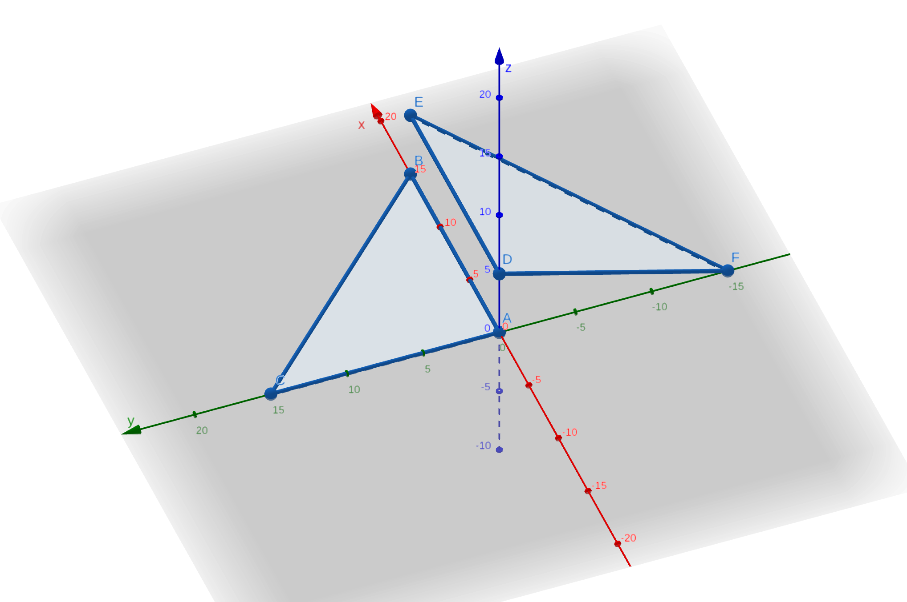
   
  <em>Test 1: TrianglesTest_cross_planes.1</em>

  <em>Expected: nothing</em>

   

  
   
  <em>Test 2: TrianglesTest_cross_planes.2</em>

  <em>Expected: cross</em>

